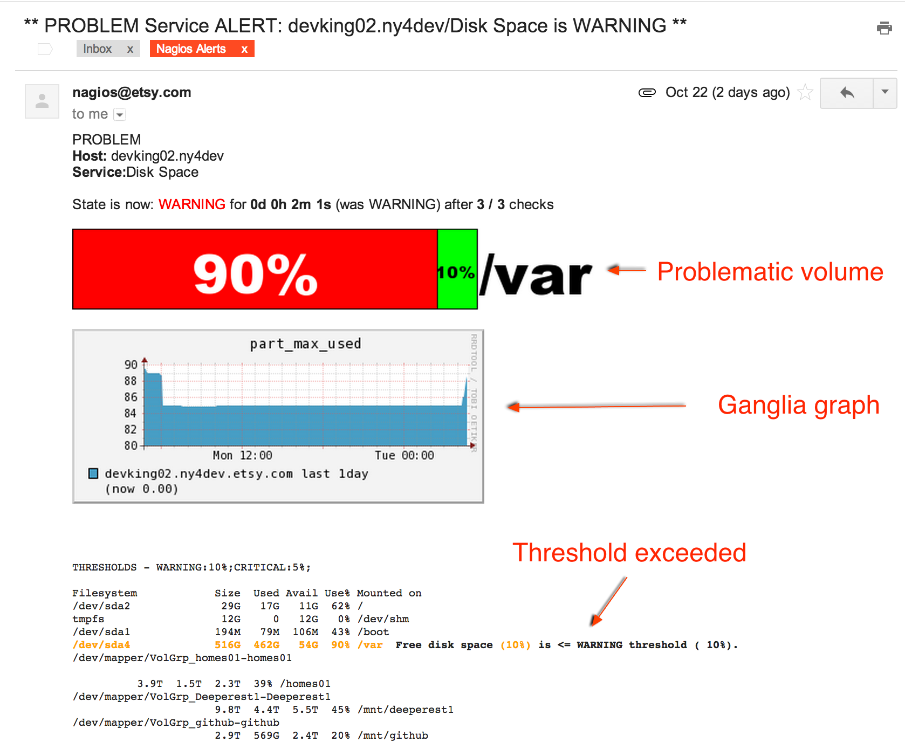

# nagios-herald

``nagios-herald`` is a project that aims to make it easy to provide context in Nagios alerts.

It was created from a desire to supplement an on-call engineer's awareness of conditions surrounding a notifying event. In other words, if a computer is going to page me at 3AM, I expect it to do some work for me to help me understand what's failing.

## Customizing Nagios Alerts

777
Nagios is a time-tested monitoring and alerting tool used by many Operations teams to keep an eye
on the shop.  It does an excellent job of executing scheduled checks, determining when a threshold has been exceeded, and sending alerts.

Past experience with Nagios has shown that, typically, those alerts provide little information beyond the fact that a host is down or a service is not responding as defined by check thresholds. It's bad enough to be woken up by an alert; it would make the on-call experience more bearable if the alerts could tell the engineer more about what's going on.  But what's useful in an alert?

When notified, an engineer often performs a set of procedures to gather information about the event before attempting to correct it.  Imagine being able to automatically perform those procedures (or some subset) at the time of the alert. Imagine further, that the results of those procedures are embedded in the alert!

Enter ``nagios-herald``!

### Generic Nagios Alert

Using the canonical (and oft-maligned) disk space check, here's an example notification:

While it does provide necessary information, it could be formatted for better legibility.  For example,
the following line, which contains the information we need, is dense and may be difficult to
parse in the wee hours of the morning:

    Additional Info: DISK WARNING - free space: / 1597 MB (8% inode=57%):
    /dev/shm 24127 MB (100% inode=99%): /boot 152 MB (83% inode=99%):

Common questions would be **"Which volume is problematic?"** or
**"Why is this considered a 'WARNING' alert?"**  In this example, it's not readily apparent what
those answers are.  Let's add that context with ``nagios-herald``.

### Nagios Alert with Context

``nagios-herald`` can **highlight and colorize text**, **embed images** (such as Ganglia graphs), **include search results**, and much more.

The previous disk space alert example can be tailored to look like this:

Notice the handy **stack bar** that clearly illustrates the problematic volume?  See that **Ganglia graph**
showing disk space utilization for the node in the last 24 hours. Curious why the alert fired?  Check
the **highlighted ``df`` output** that neatly defines which threshold was exceeded and why.

**NOTE**: In this example, the Nagios check ran ``df`` and supplied that input.

### More Examples

For more examples of ``nagios-herald`` in action, see the [example alerts](/docs/example_alerts.md) page.

This is possible because ``nagios-herald`` provides extensible formatters.

## Formatters

Adding context to alerts is done by the formatters. Formatters generate all the content that may
be used by one or more message types. For example, text returned by a Nagios check
can be highlighted to grab the operator's attention.

To learn more, see the [formatters](/docs/formatters.md) page.

# Installing ``nagios-herald``

Installation of ``nagios-herald`` is as easy as cloning this repository to a location of your choice.
To enable ``nagios-herald`` to send notifications, [configure Nagios](/docs/nagios-config.md) and,
optionally, write a [config.yml](/docs/config.md) file. At a minimum, specify the ``logfile`` configuration
variable.

## Dependencies

### Ruby Gems

``nagios-herald`` and its tools depend on the following Ruby gems:

* ``app_conf``
* ``choice``
* ``mail``

### Stack Bars

Generating stack bars requires the following (which are included in this project for your convenience):

* Python
* Python Image Library (PIL)

## Configuring Nagios

To configure Nagios to use ``nagios-herald`` for notifications, see the [Nagios Configuration](/docs/nagios-config.md) page.

